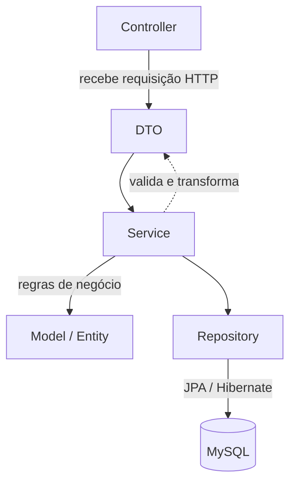

# DesafioBancario

API REST de banco digital (estilo PicPay), desenvolvida em **Java + Spring Boot**, seguindo arquitetura em camadas (*Controller → Service → Repository*), com persistência versionada via **Flyway** e cobertura de testes unitários com **JUnit + Mockito**.

Projeto de estudo hands-on, com foco em consolidar Spring Boot, Spring Data JPA, boas práticas de testes e, na próxima etapa, autenticação/autorização com **JWT + Spring Security**.

---

## 📌 Status do projeto

- [x] Modelagem de entidades (Usuario, Conta, Transacao)
- [x] Camada de persistência com migrations versionadas (Flyway)
- [x] Camada de serviço com regras de negócio
- [x] Testes unitários da camada de Service (Mockito)
- [ ] Testes da camada de Controller (`@WebMvcTest`)
- [ ] Testes da camada de Repository (`@DataJpaTest`)
- [ ] Autenticação e autorização com JWT (Spring Security)
- [ ] Tratamento global de exceções (`@ControllerAdvice`)

---

## 🚀 Tecnologias utilizadas

| Categoria | Tecnologia |
|---|---|
| Linguagem | Java 17 |
| Framework | Spring Boot 4.1.0 |
| Persistência | Spring Data JPA / Hibernate |
| Banco de dados | MySQL |
| Migrations | Flyway |
| Testes | JUnit 5 + Mockito (`spring-boot-starter-webmvc-test`, `spring-boot-starter-data-jpa-test`) |
| Boilerplate | Lombok |
| Build | Maven |

> Observação: o projeto usa os *starters* modulares de teste do Spring Boot 4 (`spring-boot-starter-webmvc-test`, `spring-boot-starter-data-jpa-test`, `spring-boot-starter-flyway-test`), que substituem o antigo `spring-boot-starter-test` monolítico das versões 3.x.

---

## 🏗️ Arquitetura em camadas

O projeto segue o padrão clássico de camadas do Spring, isolando responsabilidades:



**Responsabilidade de cada camada:**

- **Controller** (`TransacaoController`, `UsuarioController`): expõe os endpoints REST, recebe/retorna DTOs, delega toda a lógica para a camada de Service.
- **DTO** (`TransacaoDTO`, `UsuarioDTO` — implementados como `record`): isola o contrato da API do modelo interno de domínio, evitando expor entidades JPA diretamente.
- **Service** (`ContaService`, `TransacaoService`, `UsuarioService`): concentra as regras de negócio (ex.: validação de CPF/e-mail duplicado, movimentação de saldo entre contas).
- **Model / Entity** (`Usuario`, `Conta`, `Transacao`, enum `TipoUsuario`): representa o domínio persistido.
- **Repository**: interfaces `JpaRepository` responsáveis pelo acesso a dados.

---

## 📂 Estrutura de pastas

```
com.example.DesafioBancario
├── Controller
│   ├── TransacaoController
│   └── UsuarioController
├── DTO
│   ├── TransacaoDTO      (record)
│   └── UsuarioDTO        (record)
├── Model
│   └── Users
│       ├── TipoUsuario   (enum)
│       ├── Conta
│       ├── Transacao
│       └── Usuario
├── Repository
|   ├── ContaRepository
|   ├── TransacaoRepository
|   └── UsuarioRepository
├── Service
│   ├── ContaService
│   ├── TransacaoService
│   └── UsuarioService
└── DesafioBancarioApplication

resources
├── db.migration
│   ├── v1__Criar_tabela_Usuario.sql
│   ├── v2__Criar_tabela_Conta.sql
│   └── v3__Criar_tabela_Transacao.sql
├── static
├── templates
└── application.properties

test
└── java/com.example.DesafioBancario
    └── Service
        ├── ContaServiceTest
        ├── TransacaoServiceTest
        └── UsuarioServiceTest
```

---

## 🗄️ Modelagem de dados

O schema é versionado via **Flyway**, com uma migration por entidade, na ordem de dependência:

| Migration | Responsabilidade |
|---|---|
| `v1__Criar_tabela_Usuario` | Cria a tabela `usuario`, base para autenticação e identificação do cliente |
| `v2__Criar_tabela_Conta` | Cria a tabela `conta`, vinculada a um `Usuario` (relação 1:1 ou 1:N, conforme regra de negócio) |
| `v3__Criar_tabela_Transacao` | Cria a tabela `transacao`, registrando movimentações entre contas |

**Entidades principais:**

- `Usuario` — dados cadastrais do cliente, com o enum `TipoUsuario` distinguindo perfis (ex.: pessoa física / lojista, no modelo PicPay-like).
- `Conta` — saldo e vínculo com o `Usuario` dono da conta.
- `Transacao` — histórico de transferências, com conta de origem, conta de destino e valor.

---

## 🔌 Endpoints (convenção REST — ajuste conforme sua implementação)

Como os `Controllers` seguem convenção REST padrão, os endpoints esperados são:

| Método | Rota | Descrição |
|---|---|---|
| `POST` | `/usuario/CadastrarUser` | Cadastra um novo usuário (valida CPF e e-mail duplicados) |
| `GET` | `/usuario/{id}` | Busca usuário por ID |
| `POST` | `/transacao/create` | Realiza uma transação entre contas |


---

## ✅ Estratégia de testes

Cobertura atual: **camada de Service**, com JUnit 5 + Mockito, isolando a lógica de negócio dos repositórios via mocks (`@Mock` / `@InjectMocks`).

**Cenários já cobertos:**
- Rejeição de cadastro de usuário com **CPF duplicado**
- Rejeição de cadastro de usuário com **e-mail duplicado**

**Próximas camadas a testar:**
- `@WebMvcTest` para os Controllers (validação de contrato HTTP, status codes, serialização de DTOs)
- `@DataJpaTest` para os Repositories (queries customizadas, se houver)
- Testes de integração com `@SpringBootTest` para o fluxo completo de transação

**Lições técnicas registradas durante o desenvolvimento** (para referência futura):
- Uso de tipos *wrapper* (`Long`) em vez de primitivos (`long`) no campo `@Id` das entidades — evita `ObjectOptimisticLockingFailureException` causada pelo Hibernate não conseguir diferenciar corretamente entre insert e update.
- Atenção ao import correto de `@Id` (`jakarta.persistence.Id` vs `org.springframework.data.annotation.Id`) para não conflitar o mapeamento JPA.
- Garantir a anotação `@Service` nas classes de serviço para evitar erro de bean não encontrado na injeção de dependência.

---

## ▶️ Como rodar o projeto

**Pré-requisitos:** Java 17, Maven, MySQL rodando localmente.

1. Clone o repositório
2. Configure a conexão com o banco em `src/main/resources/application.properties`:
   ```properties
   spring.datasource.url=jdbc:mysql://localhost:3306/desafio_bancario
   spring.datasource.username=root
   spring.datasource.password=
   ```
3. As migrations do Flyway rodam automaticamente na subida da aplicação, criando o schema.
4. Execute:
   ```bash
   ./mvnw spring-boot:run
   ```
5. Para rodar os testes:
   ```bash
   ./mvnw test
   ```

---

## 🗺️ Roadmap

- [ ] **Autenticação JWT** com Spring Security — login, geração e validação de token, filtro `OncePerRequestFilter`
- [ ] Autorização por perfil (`TipoUsuario`) usando `@PreAuthorize` / `SecurityFilterChain`
- [ ] Tratamento global de exceções (`@ControllerAdvice` + exceptions customizadas de domínio)
- [ ] Testes de Controller e Repository
- [ ] Documentação da API com Swagger/OpenAPI
- [ ] Validação de payload com Bean Validation (`@Valid`, `@NotNull`, etc. nos DTOs)

---

## 👤 Jeovan Gomes

Projeto de estudo desenvolvido por Jeovan, como prática hands-on de Spring Boot, arquitetura em camadas e testes automatizados.
